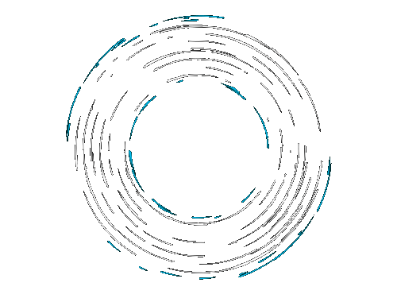

#  Ansh Dubey

**` SWE @ RenovationFind.com | Prev @ Intuit`**

  

 Hello there!👋 
 
 I'm a full stack developer with a passion for building amazing things! My expertise lies in Web/Mobile Development, and generally in Software Engineering. I love taking on new challenges and solving complex problems with elegant solutions.

 

      
      
    
    </a>

---

### 🧰 Languages and Tools

 

#

### 📊 Stats

